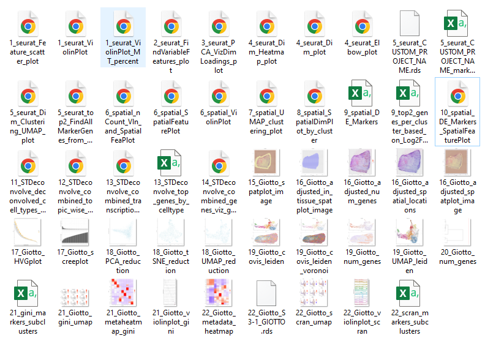

# Analysis Pipeline for Visium 10x Data [visium10x-spatial-transcriptomics-pipeline]
This repository provides an R-based pipeline for analyzing spatial RNA-seq data using ***Seurat***, 
***STDeconvolve***, and ***Giotto***. Designed to process and analyze spatial transcriptomics data 
through a sequence of well-defined steps, enabling in-depth exploration and interpretation 
of spatially resolved gene expression profiles.

> Note: Make sure to have older version of Giotto (1.1.2).

### Tools used:

| Tool         | Functions                                                    |
|--------------|--------------------------------------------------------------|
| [Seurat](https://satijalab.org/seurat/articles/spatial_vignette)       | `automated_seurat_analysis_func`, `automated_seurat_spatial_analysis_func` |
| [STDeconvolve](https://jef.works/STdeconvolve/) | `decolvolve_spatial_transcriptomics_analysis`               |
| [Giotto](https://rubd.github.io/Giotto_site/)       | `giotto_spatial_transcriptomics_analysis`                   |

### Files:

| File Name                       | Description                                     |
|---------------------------------|-------------------------------------------------|
| `run_analysis.R`                | Main script to run the entire analysis pipeline. |
| `package_installer.R`            | Script to install necessary R packages.         |
| `seurat_analysis.R`             | Functions for Seurat-based analysis.            |
| `cell_deconvolution_analysis.R` | Functions for cell deconvolution analysis.      |
| `giotto_gene_expr_analysis.R`   | Functions for Giotto-based analysis.            |

### Installation:
```commandline
git clone https://github.com/utdal/visium10x-spatial-transcriptomics-pipeline.git
cd visium10x-spatial-transcriptomics-pipeline
```

### How to run the pipeline:
Note: Prior to running the pipeline, one needs to install R and RStudio/VSCode for running the R-based pipeline.

1. Open `run_analysis.R` in Rstudio/VSCode.
2. Modify the directory paths, per sample.
3. Additionally, for Giotto analysis, there is a chance that the barcodes may not overlap with the tissue, in that case; `xmax_adj`, `xmin_adj`, `ymax_adj` and `ymin_adj` need to be adjusted accordingly.
4. Outputs generated are saved to the directory path defined in `run_analysis.R` file.

### Output
The script will generate various output files which include:

1. Plots (e.g., UMAP, PCA, heatmaps)
2. CSV files with marker genes
3. RDS files with processed data

##### Plots generated:


### Troubleshooting
1. Missing Files: Ensure all required files are present in the specified paths.
2. Package Issues: Install any missing R packages using package_installer.R.
3. Path Errors: Double-check file paths and directory names in the run_analysis.R script.

> [Known Issues](https://github.com/utdal/visium10x-spatial-transcriptomics-pipeline/issues/1): `STDeconvolve` and `Giotto` need the input files to be in the following format:
> ```
> -- sample
>    -- outs
>      -- filtered_feature_bc_matrix
>         -- barcodes.tsv.gz
>         -- features.tsv.gz
>         -- matrix.mtx.gz
>      -- raw_feature_bc_matrix
>         -- barcodes.tsv.gz
>         -- features.tsv.gz
>         -- matrix.mtx.gz
>      -- spatial
>         -- tissue_positions_list.csv
>         -- scalefactors_json.json
>      -- filtered_feature_bc_matrix.h5
>      -- raw_feature_bc_matrix.h5
>      -- etc.
>```


Contant: For questions or issues, please reach out [Dr. Tavares Ferreira, Diana](diana.tavaresferreira@utdallas.edu) or [Nikhil Nageshwar Inturi](inturinikhilnageshwar.com). 
